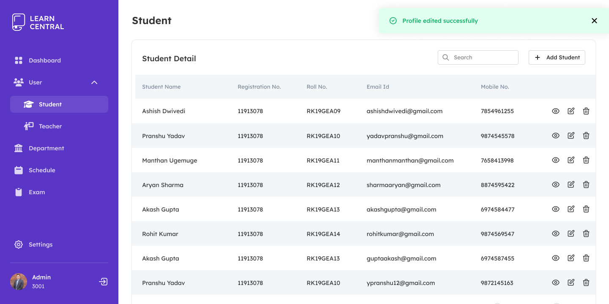
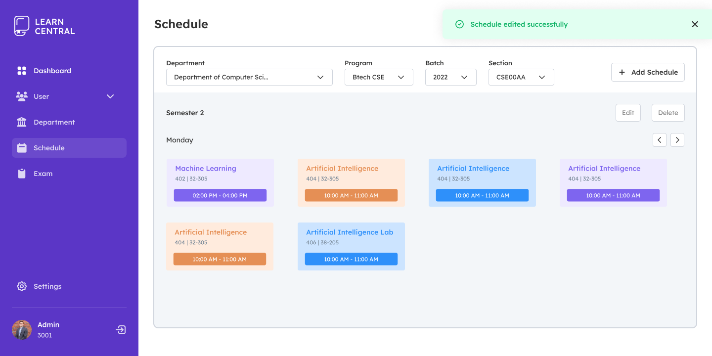

<h1>Learning Management System (LMS) Project</h1>

This repository contains the source code for a Learning Management System (LMS) project. The project aims to provide an online platform for educational institutions to manage their courses, students, assessments, and more. The system consists of three main profiles: Admin, Teacher, and Student.

<h2>Admin Side/Profile</h2>

The Admin side serves as the main dashboard for project administration. The Admin has superuser privileges and can manage multiple organizations using the project. Some key features and responsibilities of the Admin include:

<ul>
  <li>Managing departments within the organization</li>
  <li>Assigning tasks and responsibilities to department staff</li>
  <li>Monitoring employee performance</li>
  <li>Developing and implementing department policies and procedures</li>
  <li>Ensuring compliance with regulations</li>
  <li>Managing department budgets and expenses</li>
  <li>Collaborating with other departments and stakeholders</li>
  <li>Providing training and support to department staff</li>
  <li>Identifying areas for improvement and implementing necessary changes</li>
</ul>

<h2>Teacher Side/Profile</h2>

The Teacher side provides a dashboard for teachers to effectively manage their courses and track student progress. Some features and functionalities available to teachers include:

<ul>
  <li>Course creation and management</li>
  <li>Student enrollment and progress tracking</li>
  <li>Analytics and reporting on student performance</li>
  <li>Collaboration and communication with other teachers and staff</li>
  <li>Customization options for course layout and notifications</li>
</ul>

Additionally, teachers can create assessments and quizzes, manage attendance, and provide feedback to students.

<h2>Student Side/Profile</h2>

The Student side offers a dashboard for students to access course materials, track progress, and communicate with teachers and peers. Some features available to students include:

<ul>
  <li>Course overview and access to course materials</li>
  <li>Progress tracking and grade viewing</li>
  <li>Communication tools for messaging and discussions</li>
  <li>Calendar and scheduling for assignment deadlines and course events</li>
  <li>Personalization options for layout and themes</li>
</ul>

Students can also view their timetable, and attendance, and download learning materials and syllabi. Quizzes and assessments assigned by teachers can be viewed and attempted through the student dashboard.

<h2>Getting Started</h2>

To get started with the LMS project, follow these steps:

<ol>
  <li>Clone the repository: <code>git clone &lt;repository_url&gt;</code></li>
  <li>Install dependencies: <code>npm install</code></li>
  <li>Configure the project by setting up environment variables or configuration files.</li>
  <li>Start the server: <code>npm start</code></li>
  <li>Access the application through the provided URL.</li>
</ol>

Please refer to the project documentation for detailed instructions on installation, configuration, and usage.
